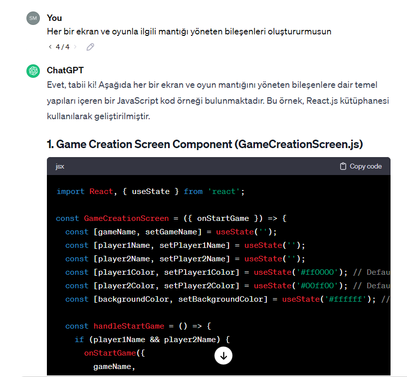
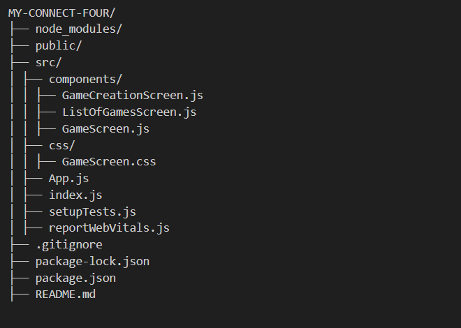
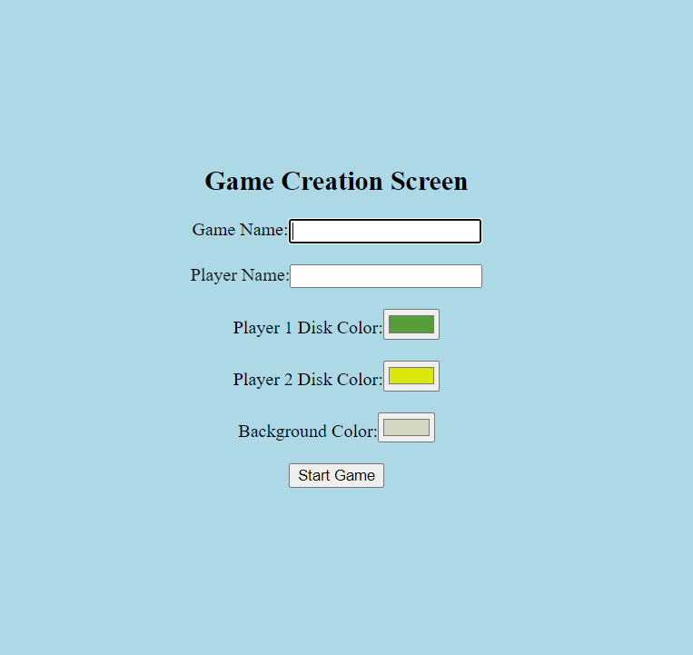
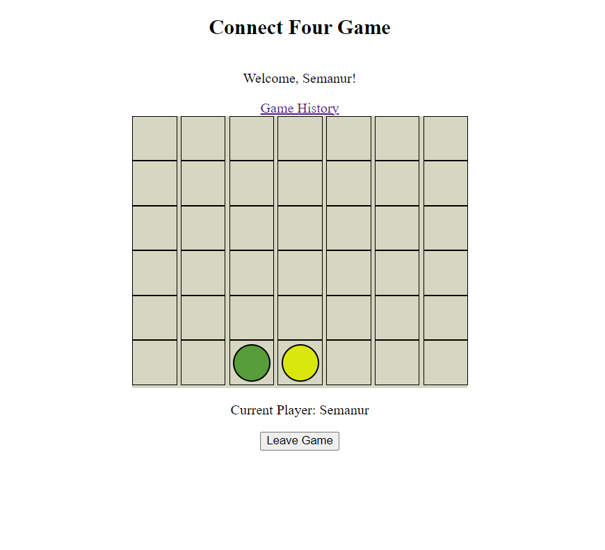
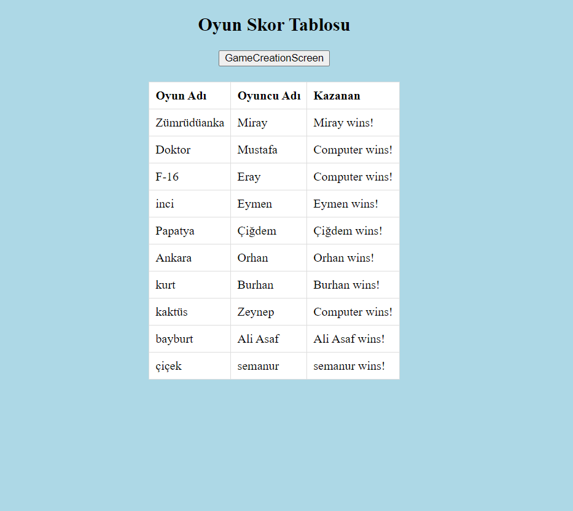

# My Connect Four Game

## Project Code Description
<details> 
<h2>



</h2>
</details>

## App.js



- **Routing**: Utilizes `react-router-dom` for page navigation.
- **Routes**:
  1. **Game Creation Screen (`/`)**: `GameCreationScreen` component with `startGameHandler`.
  2. **Game Screen (`/game`)**: `GameScreen` component with `leaveGameHandler`.
  3. **List Of Games Screen (`/history`)**: `ListOfGamesScreen` component.

## Game Creation Screen

- **Hooks**: Uses `useState` and `useEffect`.
- **localStorage**: Stores user values for persistence.
- **Color Selections**: Allows users to choose player disk colors and background.
- **Start Game**: Clicking "Start Game" redirects to the main game screen.

## Game Screen

- **Hooks**: Uses `useState` and `useEffect`.
- **Game Board**: 6x7 grid for gameplay.
- **Game Status Checking**: Checks for winners and draws.
- **Computer Moves**: `makeRandomMove` simulates computer decisions.
- **Updating Board**: `dropDisk` processes user or computer moves.
- **Resetting Game**: `resetGame` starts a new round.
- **Saving Game Info**: Records winner info in localStorage.
- **Page Navigation**: `useNavigate` redirects on leaving the game.
- **Color and Theme Settings**: Adapts colors based on user preferences.

## List Of Games Screen

- **localStorage**: Retrieves game info from localStorage.
- **Updating Score Table**: Updates winners for each game.
- **Last 10 Games**: Displays the last 10 games.
- **Table Rendering**: Uses `table` element for score display.

## Project Description

This project is a digital implementation of the classic board game "Connect Four," designed as a web application. The game offers an interactive and engaging experience for players through three main screens: Game Creation Screen, Game Screen, and List of Games Screen.


## Installation

To set up the project on your local machine, follow the steps below:

1. Download the project files to your computer.
2. Navigate to the project directory in your terminal or command prompt.

  ```bash
  cd my-connect-four
  ```

3. Use the following command to install the necessary dependencies:

    ```bash
    npm install
    ```

4. In the project directory, start the application by using the following command:

    ```bash
    npm start
    ```

After following these steps, your application should be up and running


### 1. Game Creation Screen


This screen serves as the starting point where players input essential information before starting the game. Key features include:

- **Game Name:** Set the name of the game.
- **Player Names:** Enter names for each player.
- **Player Disk Colors:** Allow players to choose their disk colors.
- **Background Color:** Determine the background color of the game.
- **Start Game Button:** Validates input information and transitions to the Game Screen upon successful validation.

### 2. Game Screen


The main gameplay screen with the following features:

- **Player Greeting:** Displays a personalized welcome message for the first player's name.
- **Game Grid:** Represents the 7x6 game grid for Connect Four.
- **Current Player:** Indicates which player is currently making a move.
- **Game History Button:** Saves game information and transitions to the List of Games Screen.
- **Leave Game Button:** Allows exiting the game and returning to the Game Creation Screen.

#### Game Flow

The game provides an interactive experience for the user.

- After the player drops the first disc, the computer makes a move within 1 second.
- Consecutive moves can occur if the player clicks twice within one second.
- A new game starts automatically when the game ends in a tie.

### 3. List of Games Screen


This screen displays a table of game scores with the following features:

- **Game Score Table:** Shows the names, player names, and winner information for the last 10 games.
- **Game Creation Screen Button:** Allows returning to the Game Creation Screen.

#### Updating the Score Table

- If the same game name is entered and already listed, only the winner and player name are updated.
- The same game is not listed multiple times.

## How to Use

1. Specify the player name and game name on the Game Creation Screen.
2. Choose the disk colors and background color for the players.
3. Drop the first disc on the game screen and wait for the computer's move.
4. If the game ends in a tie, it automatically starts a new game.
5. To view the previous and current game lists, check the Game History section.
6. If you want to exit the game or change game information, click the Leave Game button.

Enjoy playing the application!
